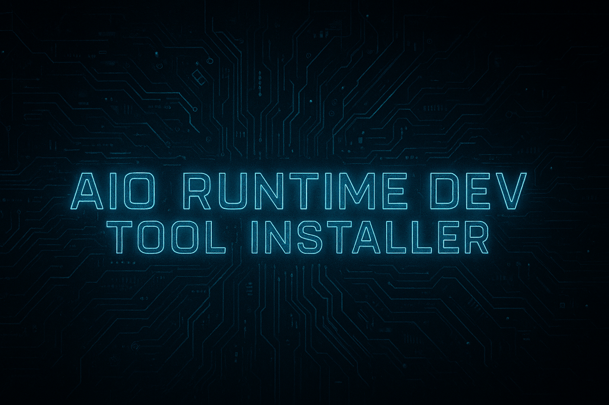

<p align="center">  </p>

Universal Runtime & Dev Tool Installer
======================================

Author: XechostormX
Purpose: One-click (elevated) PowerShell script to silently install or enable a full suite of legacy and modern runtimes, libraries, and developer tools needed for old games, modern applications, and development work.

I write stuff when I get annoyed that something I need doesn't exist. So here's an AIO that gives you everything you need on Windows 11 to get gaming, or installing your build environment, mysys etc.
Every other one I tried on every github and website SUCKS. This one doesn't. The non-'library' extras it installs are winget, PowerShell 7, Git, Node.js, CMake, and VS Code, because... yeah.

Installation
------------
place the .bat and the .ps1 somewhere that has write permissions. (D: , Downloads, Desktop, etc.)
Double Click the .bat file
Go find something to do for like 10 minutes.

Want to see what it would do first without touching anything? Run it with `-DryRun`:
```
RUN_ME.bat -DryRun
```

Key Features
------------
- Skips components already present (path/registry/file checks)
- Re-verifies each component after install instead of trusting the installer's exit code alone - a component only counts as "Installed" if the same presence check that would've skipped it now passes
- Retries failed downloads up to 3 times with 5-second delay, and rejects suspiciously tiny downloads (usually an error page instead of the real installer)
- Detailed timestamped logging to console and file
- Clean final summary: Installed (green), Skipped (yellow), Failed (red)
- `-DryRun` switch previews every action (including what it would download) without installing or writing anything
- Git, PowerShell, CMake, the Temurin JDKs, and Node.js are resolved to their latest release/LTS at run time (via GitHub/Adoptium/nodejs.org APIs) instead of a hardcoded version, with a pinned fallback if the API can't be reached
- Cleans up all temporary files at the end
- Protects header from progress bar overwrite with blank lines
- Handles reboot-required exit codes (3010/1641/1638) as success
- No forced reboots (/norestart everywhere)
- Forces TLS 1.2 for downloads so it doesn't silently fail on a fresh Windows install with an older negotiated default
- Warns (without blocking) if a downloaded installer isn't Authenticode-signed, so a tampered/MITM'd download doesn't run silently unnoticed

What It Installs / Enables (Full Itemized List)
-----------------------------------------------

1. winget (Windows Package Manager / App Installer)
   - Skipped if `winget` is already on PATH
   - Falls back to fetching Microsoft's dependency bundle and retrying if the direct install fails (common on a bare-minimum Windows image)

2. 7-Zip portable (7za.exe)
   - Downloaded only if missing
   - Used internally for DirectX extraction

3. .NET Framework 3.5
   - Enabled via Windows Optional Feature (NetFx3)
   - Skipped if registry shows it's already installed

4. DirectX June 2010 Redistributable (full legacy DirectX 9.0c)
   - Downloads directx_Jun2010_redist.exe
   - Extracts entire ~140 MB archive (~hundreds of .cab files) using 7za
   - Runs DXSETUP.exe /silent → installs ALL included components:
     - Direct3D 9 (including d3dx9_1 to d3dx9_43.dll)
     - DirectDraw / Direct3D Retained Mode (d3drm.dll)
     - DirectInput, DirectPlay, DirectSound, DirectMusic
     - XAudio2, XACT, XInput 1.3/1.4
     - Managed DirectX (rare .NET usage)
     - All legacy codecs/filters for old games
   - Skipped if d3dx9_43.dll already exists in System32
   - Covers backwards compatibility for most DirectX 7/8 games

5. Legacy OpenAL (Creative Labs oalinst.exe)
   - Classic OpenAL installer
   - Skipped if HKLM\SOFTWARE\Creative Labs\OpenAL registry key exists

6. OpenAL Soft (modern replacement, v1.25.1)
   - Downloads openal-soft-1.25.1-bin.zip
   - Extracts and copies soft_oal.dll → OpenAL32.dll in System32 and SysWOW64
   - Skipped if both OpenAL32.dll files already exist

7. Visual C++ Redistributables (2005–2022)
   - 2005 x86/x64
   - 2008 x86/x64
   - 2010 x86/x64 (from Windows Update catalog)
   - 2012 x86/x64
   - 2013 x86/x64
   - 2015–2022 merged x86/x64 (evergreen `aka.ms/vs/17` link, always latest)
   - Skipped individually if correct registry version key exists

8. .NET Runtimes
   - Framework 4.8.1 (offline installer)
   - .NET 8 ASP.NET Core Runtime + Desktop Runtime (LTS, supported through Nov 2026)
   - .NET 9 ASP.NET Core Runtime + Desktop Runtime (STS, supported through Nov 2026)
   - .NET 10 ASP.NET Core Runtime + Desktop Runtime (current LTS)
   - All pulled from Microsoft's evergreen `aka.ms/dotnet/<version>/...` links, so they always grab the latest patch
   - .NET 6 and 7 are intentionally not installed - both are past end-of-support
   - Skips based on registry (major version folder for Core, Release value for Framework)

9. Adoptium Temurin OpenJDK
   - JDK 21 (latest LTS)
   - JDK 17 (LTS)
   - JDK 8 (legacy)
   - Resolved via Adoptium's "latest" API, so patch releases stay current automatically
   - Installed with `INSTALLLEVEL=1` so PATH and JAVA_HOME actually get set - the Temurin MSI skips both by default on a bare `/quiet` install
   - Skipped if install folder already exists under C:\Program Files\Eclipse Adoptium\

10. Vulkan Runtime (LunarG evergreen "latest" link)
    - Silent installer
    - Skipped if HKLM\SOFTWARE\Khronos\Vulkan\Runtime exists

11. Microsoft Edge WebView2 Runtime
    - Evergreen bootstrapper (silent)
    - Skipped if client registry key exists

12. PowerShell 7 (latest release)
    - Resolved from the PowerShell/PowerShell GitHub releases API at run time, with a pinned fallback if GitHub can't be reached
    - MSI installer with context menu, remoting, manifest, and `ADD_PATH=1` (a bare `/quiet` install otherwise leaves pwsh off PATH)
    - Skipped if an installed pwsh.exe already meets that version

13. Python (pinned versions, refreshed periodically)
    - 3.10.20, 3.11.15, 3.12.13, 3.13.14
    - All-users install, adds to PATH, includes the 'launcher'
    - Skipped if python.exe exists in versioned folder

14. Git for Windows (latest release)
    - Resolved from the git-for-windows/git GitHub releases API at run time, with a pinned fallback if GitHub can't be reached
    - Very silent with icons, shell assoc, git-lfs
    - Skipped if git.exe exists in Program Files\Git\bin

15. Node.js (latest LTS)
    - Resolved from the official nodejs.org dist index at run time (skips any non-LTS "current" releases), with a pinned fallback if that can't be reached
    - Installed with `ADDLOCAL=ALL` so npm and PATH are included
    - Skipped if node.exe exists in Program Files\nodejs

16. CMake (latest release)
    - Resolved from the Kitware/CMake GitHub releases API at run time, with a pinned fallback if GitHub can't be reached
    - Installed with `ADD_CMAKE_TO_PATH=System` (undocumented but stable - it's what CMake's own installer exposes and what GitHub Actions' runner-images setup uses)
    - Skipped if cmake.exe exists in Program Files\CMake\bin

17. Visual Studio Code (latest stable user x64)
    - Very silent, no auto-run
    - Skipped if Code.exe exists in %LOCALAPPDATA%\Programs\Microsoft VS Code

Behavior Notes
--------------
- All downloads use retry logic (3 attempts) and reject implausibly small files
- Every component is re-verified after install using the same check that would've skipped it - the summary only calls something "Installed" once that's confirmed true, not just because the installer's exit code looked fine
- DirectX extraction installs hundreds of files (DLLs, .inf, .cat, etc.) via official DXSETUP.exe
- No separate DirectX 7/8 installers (June 2010 provides backwards compatibility)
- Temp folder fully deleted at end (unless run with `-DryRun`, which touches nothing)
- Designed to run elevated (batch wrapper recommended)

Bonus: Windows Terminal Profile
--------------------------------
[`terminal/settings.json`](terminal/settings.json) is a color-coded Windows Terminal config that lines up with everything above - a profile per Python version, a Node.js REPL, a JShell (JDK 21) REPL, plus the usual shells. See [terminal/README.md](terminal/README.md) for install steps and caveats.

Enjoy your fully loaded legacy + modern runtime setup!
